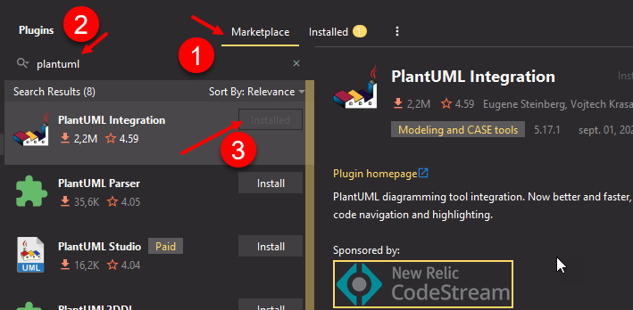

ifndef::_main_loaded[]
include::../config/load_attributes.adoc[]
endif::_main_loaded[]
//titre de la section
[[quels_outils_pour_réaliser_des_diagrammes_de_classes_]]
= Quels outils pour réaliser des diagrammes de classes ?
ifndef::_main_loaded[]
include::../config/header_attributes.adoc[]
{empty}
Point précédent :
link:01-1-representation-d-une-classe.adoc[Représentation d'une classe]
endif::_main_loaded[]

[[quelques_outils_uml]]
== Quelques outils UML

Il existe de nombreux outils pour réaliser des diagrammes de classe.

* *Dia* (https://dia.fr.softonic.com/) : logiciel gratuit, léger et simple à prendre en main.
* *Argouml* (https://argouml.fr.uptodown.com/windows). Logiciel gratuit assez simple à prendre en main.
* *Staruml* (https://staruml.io/). Logiciel agréable à utiliser et bénéficiant d'une interface assez pratique (mais payant après une période d'essai).
* et de nombreux logiciels payants (windesign,...)
* *PlantUml* (https://plantuml.com/fr/). C'est plus un moteur de rendu qui permet de générer des diagrammes uml à partir de lignes de texte.
C'est gratuit.

[[plant_uml]]
== PlantUml

[[keyword_plant_uml]]*[.keyword]#((PlantUml))#* est l'outil que je préconise car il permet de faire évoluer rapidement les diagrammes.
Il permet de générer de nombreux diagrammes (https://plantuml.com/fr/).

Sa particularité tient dans le fait qu'il n'y a aucune interface graphique.
Un diagramme est réalisé à partir de lignes de "code" qui décrivent ce que le moteur de PlantUml doit "dessiner".

Comme il s'agit de lignes de "code", il est très facile de versionner ses modélisations.

[.question]
****
*Q{counter:_question})*
Travail à faire

* Chargez la documentation de Plant Uml concernant les diagrammes de classe (https://plantuml.com/fr/class-diagram)
* Chargez la page qui permet de réaliser des diagrammes (http://www.plantuml.com/plantuml/uml/)
* Réalisez directement dans l'éditeur ouvert précédemment le diagramme de classes correspondant à ces besoins :
** Il faut modéliser deux classes dont les instances vont être persistées en base de données.
Il y a deux objets à conceptualiser.
*** Le premier est un employé qui est caractérisé par un numéro unique, un nom, une date de naissance.
Il doit être possible de retourner l'âge d'un employé en années entières.
*** Le second objet est une entreprise caractérisée par sa dénomination sociale et les employés qu'elle fait travailler.
Une méthode doit retourner le nombre d'employés qu'elle fait travailler.
** La définition des différents attributs doit respecter le principe d'encapsulation.
//end _question
****

ifeval::[{_show_correction} == 1]
[.answer]
****
_Correction de Q{_question}_

ifeval::[{_show_plantuml} == 1]
[plantuml,format=svg,role=class]
....
hide circle
skinparam classAttributeIconSize 0

class Person {
    - id: int {id} //pas besoin d'écrire {unique} pour un id
    - name: string
    - dateOfBirth: Datetime //ou tout équivalent

    +setId() //en principe, l'id est récupéré via la bdd
    +getId()
    +setName(name: string):self
    +getName(): string
    +setDateOfBirth(Datetime):self
    +getDateOfBirth(): Datetime
    + getAge(): int
}

note as N1
Il faut prévoir des accesseurs et des
mutateurs pour les propriétés privées
(principe d'encapsulation)
end note

class Enterprise {
    -corporateName: string
    -employees: Person[ ] //collection d'objets de type Person

    +setCorporateName(name: string):self
    +getCorporateName():string
    +addEmployee(e: Person):self
    +getEmployees(): array
    +removeEmployee(e: Person)
    +countEmployees():int
}

note as N2
Il faut prévoir des accesseurs et des
mutateurs pour les propriétés privées
(principe d'encapsulation)
Pour un attribut de type "collection", il
faut remplacer l'accesseur par les méthodes
"addXXX" et "removeXXX" à moins d'affecter
en une fois la collection d'employés à
l'attribut "employees"
end note

....
//_show_plantuml
endif::[]
****
//_show_correction
endif::[]

[[utiliser_plant_uml_dans_son_éditeur_de_code]]
== Utiliser PlantUml dans son éditeur de code

Les IDE tels que PhpStorm et Visual Studio Code sont capables de rendre les diagrammes une fois que le bon plugin est installé.

(((Plugin PlantUml pour éditeur de code)))
[.question]
****
*Q{counter:_question})*
Travail à faire

* En fonction de votre éditeur, cherchez et installez le plugin permettant de rendre des diagrammes écrits pour PlantUML.
* Copiez et collez le code du travail précédent de façon à le prévisualiser dans votre éditeur.
****

ifeval::[{_show_correction} == 1]
[.answer]
****
_Correction de Q{_question}_

Pour Phpstorm :
====
menu:File[Settings>Plugins]

Ensuite, il suffit de créer un nouveau fichier `PlantUML File` (ou un fichier avec l'extension `puml`)

WARNING: Un fichier `puml` doit commencer par `@startuml` et se terminer par `@enduml`.

====

====
*Pour Visual Studio Code :*

Il faut installer l'extension
https://marketplace.visualstudio.com/items?itemName=jebbs.plantuml[plantuml pour VSCode]

L'extension par défaut d'un fichier utilisant PlantUml est `plantuml`. 
Mais on peut tout à fait utiliser l'extension `puml`.
====

Code PlantUml à écrire dans le fichier :

//ne pas indiquer que le type de la source est plantuml car gitlab rend alors deux classes modélisées.
[source,txt]
----

@startuml <1>

class Person {
    - id: int {id} //pas besoin d'écrire {unique} pour un id
    - name: string
    - dateOfBirth: Datetime //ou tout équivalent

    +setId() //en principe, l'id est récupéré via la bdd
    +getId()
    +setName(name: string):self
    +getName(): string
    +setDateOfBirth(Datetime):self
    +getDateOfBirth(): Datetime
    + getAge(): int
}

class Enterprise {
    -corporateName: string
    -employees: Person[ ] //collection d'objets de type Person

    +setCorporateName(name: string):self
    +getCorporateName():string
    +addEmployee(e: Person):self
    +getEmployees(): array
    +removeEmployee(e: Person)
    +countEmployees():int
}

@enduml <2>
----
<1> Un fichier plantuml commence par `@startuml`
<2> Un fichier plantuml commence par `@enduml`

****
//_show_correction
endif::[]

[.question]
****
*Q{counter:_question})*
Travail à faire

* A l'aide du langage php, implémentez la classe suivante :

ifeval::[{_show_plantuml} == 1]
[plantuml,target=class-animal-to-implement,format=svg]
....
hide circle
skinparam classAttributeIconSize 0

class Animal {
    -name:string
    +__construct(name:string): void
    +__toString(): string //retourne la chaîne "Mon nom est xxx"
    +getName(): string|null
}
....
//_show_plantuml
endif::[]
* Une fois la classe implémentée, testez-la de façon à créer deux animaux.
* Afficher le nom du premier objet animal avec un echo directement appliqué sur l'objet afin d'appeler automatiquement la méthode `__toString`
* Afficher le nom du second objet animal en utilisant la méthode `getName()`.

****

ifeval::[{_show_correction} == 1]
[.answer]
****
_Correction de Q{_question}_

[source,php]
----
include::../assets/source_code/classe-animal-simple.php[]
----
****
//_show_correction
endif::[]

ifndef::_main_loaded[]
link:02-0-les-liaisons-entre-classes.adoc[↪ Les liaisons entre classes (préambule)]
include::../config/index.adoc[]
endif::_main_loaded[]

