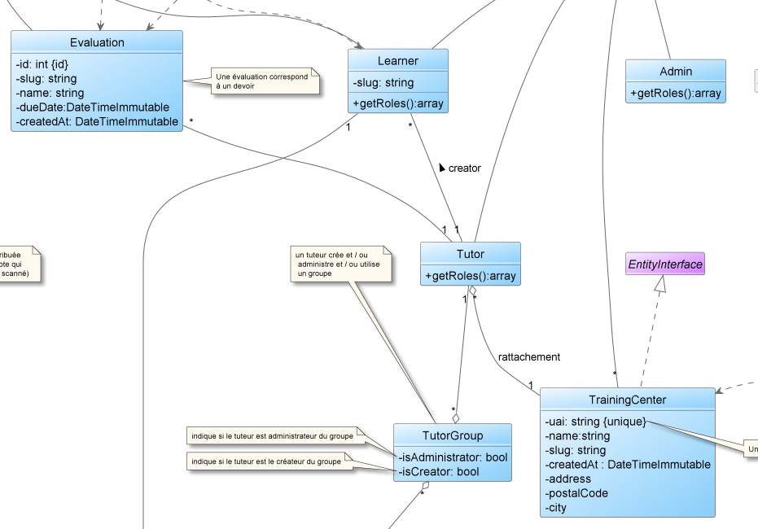

ifndef::_main_loaded[]
include::../config/load_attributes.adoc[]
endif::_main_loaded[]
//titre de la section
[[faire_des_liens_entre_les_classes]]
= Faire des liens entre les classes
ifndef::_main_loaded[]
include::../config/header_attributes.adoc[]
{empty}
Point précédent :
link:01-2-outils_uml.adoc[Quelques outils UML]
endif::_main_loaded[]

Le diagramme de classes *permet de mettre en évidence les liens entre les différentes classes* composant une application.

La *logique sémantique d’architecture de l’application* peut ainsi être lue.
C’est-à-dire que l’on peut comprendre le rôle de chaque classe dans l’application et le ou les liens qu’elles ont entre elles.
C'est également très utile pour le développeur car il sait exactement ce qu'il doit "coder".

Voici un extrait d'un diagramme de classes :

Les classes sont reliées entre elles avec parfois des traits continus, des traits pointillés, des flèches, etc.
Chaque lien a une signification particulière.
La suite de ce cours va vous permettre de déterminer quel lien utiliser pour relier des classes entre elles et comment implémenter ces liaisons.

ifndef::_main_loaded[]
Point suivant : 
link:03-1-l-association.adoc[Le lien associatif : l'association]
include::../config/index.adoc[]
endif::_main_loaded[]
