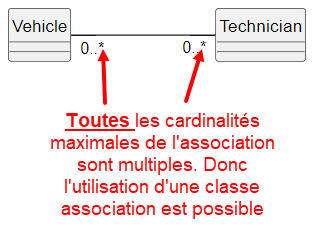
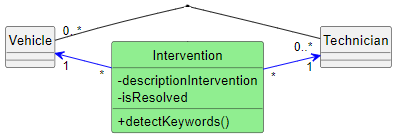

ifndef::_main_loaded[]
include::../config/load_attributes.adoc[]
endif::_main_loaded[]
//titre de la section
[[l_association_porteuse_ou_classe_association_]]
= L'association porteuse (ou classe association)
ifndef::_main_loaded[]
include::../config/header_attributes.adoc[]
{empty}
Point précédent :
link:07-1-l-association-n-aire.adoc[L'association n-aire]
endif::_main_loaded[]

== Qu'est-ce qu'une association porteuse ou classe association ?

[WARNING]
====
Avant de commencer à expliquer ce qu'est une association porteuse, sachez que cela ne peut exister que si les cardinalités situées de chaque côté de l'association sont multiples.

====

Une [[keyword_classe_association]]*[.keyword]#((classe association))#* permet de prévoir des attributs et/ou des méthodes qui ne concernent que le "couple" d'objets liés.
C'est-à-dire qu'il n'est pas possible de rattacher un tel attribut ou une telle méthode à une des deux classes en particulier.

A partir du diagramme précédent, nous savons qu'un véhicule est réparé par 0 à plusieurs techniciens et qu'un technicien répare 0 à plusieurs véhicules.

Si l'on souhaite conserver une trace de l'intervention, il faut se poser la question de la place de l'attribut à ajouter sur le diagramme.

Plaçons l'attribut `descriptionIntervention` dans la classe `Vehicle` :

ifeval::[{_show_plantuml} == 1]
[plantuml,format=svg,role=class]
....
hide circle
skinparam classAttributeIconSize 0

class Vehicle {
    -descriptionIntervention
}

class Technician

left to right direction
Vehicle "0..*" --- "0..*" Technician

....
//_show_plantuml
endif::[]

Avec cette solution, on peut connaître la description d'une intervention mais on ne saura pas quel est le technicien qui l'a écrite.
Si jamais, il faut par la suite lui poser des questions, on ne saura pas à qui s'adresser.

Adoptons une autre solution : l'attribut `descriptionIntervention` est placé dans la classe `Technician` :

ifeval::[{_show_plantuml} == 1]
[plantuml,format=svg,role=class]
....
hide circle
skinparam classAttributeIconSize 0

class Vehicle

class Technician {
    -descriptionIntervention
}

left to right direction
Vehicle "0..*" --- "0..*" Technician

....
//_show_plantuml
endif::[]

Avec cette nouvelle solution, on sait par qui est écrite une description d'intervention mais on ne sait pas quel véhicule cela concerne.

*Conclusion : l'attribut ne peut être rattaché à aucune des deux classes de l'association*.
L'attribut est rattaché à l'association ce qui en fait une [[keyword_association_porteuse]]*[.keyword]#((association porteuse))#* (ou classe association).

Lorsque vous vous trouvez dans une telle situation, c'est forcément que les cardinalités maximales de l'association sont multiples (sinon, c'est que vous vous êtes trompés sur les cardinalités ou que vous rattachez mal votre attribut).

La solution, c'est de créer une classe qui va contenir cet attribut et lier cette classe à l'association :

ifeval::[{_show_plantuml} == 1]
[plantuml,format=svg,role=class]
....
hide circle
skinparam classAttributeIconSize 0

class Vehicle

class Technician {
}

class Intervention #lightgreen {
    -descriptionIntervention
}

left to right direction
Vehicle "0..*" -- "0..*" Technician
(Vehicle, Technician) .. Intervention
....
//_show_plantuml
endif::[]

Si nous souhaitons savoir si l'intervention a résolu le problème, un nouvel attribut  `isResolved` peut être ajouté.
Cet attribut est à placer dans la classe association car il n'est pas logique de le lier au véhicule (quelle signification aurait cet attribut placé dans `Vehicle`.
On peut faire la même remarque si on le place dans `Technician`).
Si nous souhaitons connaître la présence de certains mots clés dans la description de l'intervention, l'attribut à créer ne peut être placé que dans la classe association pour les mêmes raisons.

Voici le diagramme compte tenu de ces évolutions :

ifeval::[{_show_plantuml} == 1]
[plantuml,format=svg,role=class]
....
hide circle
skinparam classAttributeIconSize 0

class Vehicle

class Technician {
}

class Intervention #lightgreen {
    -descriptionIntervention
    -isResolved
    +detectKeywords()
}

left to right direction
Vehicle "0..*" -- "0..*" Technician
(Vehicle, Technician) .. Intervention
....
//_show_plantuml
endif::[]

== Implémentation d'une classe associative

Nous savons déjà implémenter la navigabilité entre `Vehicle` et `Technician`.

Commençons par la classe `Vehicle` :

[source%linenums,php]
----
include::../assets/source_code/implementation_classe_association.php[tags=!*;class_Vehicle;class_Vehicle_addTechnician;class_Vehicle_removeTechnician;method_setTechnicians]
----

Poursuivons avec la classe `Technician` :

[source%linenums,php]
----
include::../assets/source_code/implementation_classe_association.php[tags=!*;class_Technician;!class_Vehicle_maj_objet_lie]
----

Maintenant, il faut désigner la classe possédante, c'est-à-dire celle qui va être responsable de la mise à jour des objets liés.
Je choisis la classe `Vehicle`.
C'est un choix purement arbitraire, j'aurais pu retenir la classe `Technician`.

Puisque l'on connait la classe possédante (`Vehicle`) , il faut prévoir dans celle-ci la mise à jour de l'objet lié (`Technician`).

Cela n'impacte que les méthodes `Vehicle::AddTechnician`, `Vehicle::removeTechnician` et `Vehicle::setTechnicians` :

[source%linenums,php]
----
include::../assets/source_code/implementation_classe_association.php[tags=class_Vehicle_addTechnician;class_Vehicle_removeTechnician;method_setTechnicians]
----

<1> Lorsque l'on associe un technicien, il faut que ce dernier soit associé au véhicule courant.
<2> Lorsqu'on retire un technicien du véhicule, il faut retirer le véhicule du technicien.
Cela doit être fait AVANT de supprimer le technicien sans quoi nous n'aurons plus accès à ce dernier pour appeler la méthode `Technician::removeVehicle`

L'implémentation de l'association bidirectionnelle est terminée.
Il faut maintenant gérer la classe association.

La classe association `Intervention`  est avant tout une classe comme une autre, simple à implémenter :

[source%linenums,php]
----
include::../assets/source_code/implementation_classe_association.php[tags=!*;class_Intervention]
----

Maintenant, il faut prendre en compte le fait qu'une classe association doit connaître chaque instance des extrémités de l'association sur laquelle elle porte.
Cela signifie que `Intervention` peut naviguer vers `Vehicle` et vers `Technician`.
De plus, comme une intervention ne concerne qu'un véhicule et un seul technicien simultanément, les cardinalités de `Intervention` vers `Vehicle` et `Technician` sont à 1.

Cette interprétation peut être modélisée ainsi :

[WARNING]
====
Cette représentation n'est pas valide, elle représente seulement la réflexion que l'on vient de mener.
Une classe association, c'est considérer qu'il y a un lien entre cette classe et chaque classe de l'association avec une cardinalité à 1.

Pour faire simple, quand vous voyez cela :

ifeval::[{_show_plantuml} == 1]
[plantuml,format=svg,role=class]
....
hide circle
skinparam classAttributeIconSize 0

class Vehicle

class Technician {
}

class Intervention #lightgreen {
    -descriptionIntervention
    -isResolved
    +detectKeywords()
}

left to right direction
Vehicle "0..*" -- "0..*" Technician
(Vehicle, Technician) .. Intervention
....
//_show_plantuml
endif::[]

Vous devez implémenter cela :

====

Riche de ces informations, il est facile de compléter le code de la classe en implémentant le lien entre `Intervention` et `Vehicle` :

[source%linenums,php]
----
include::../assets/source_code/implementation_classe_association.php[tags=!*;class_Intervention;class_Intervention_nav_to_Vehicle]
----

Il reste encore à implémenter le lien entre `Intervention` et `Technician` :

[source%linenums,php]
----
include::../assets/source_code/implementation_classe_association.php[tags=!*;class_Intervention;class_Intervention_nav_to_Vehicle;class_Intervention_nav_to_Technician]
----

Désormais, vous savez implémenter une classe association.
Cependant, cette implémentation n'est généralement pas la solution retenue.

[[dans_la_pratique_on_simplifie_les_choses]]
== Dans la pratique, on simplifie les choses

Dans la pratique, la modélisation suivante :
ifeval::[{_show_plantuml} == 1]
[plantuml,format=svg,role=class]
....
hide circle
skinparam classAttributeIconSize 0

class Vehicle

class Technician {
}

class Intervention #lightgreen {
    -descriptionIntervention
    -isResolved
    +detectKeywords()
}

left to right direction
Vehicle "0..*" -- "0..*" Technician
(Vehicle, Technician) .. Intervention
....
//_show_plantuml
endif::[]

est simplifiée comme ceci :

ifeval::[{_show_plantuml} == 1]
[plantuml,format=svg,role=class]
....
hide circle
skinparam classAttributeIconSize 0

class Vehicle

class Technician {
}

class Intervention #lightgreen {
    -descriptionIntervention
    -isResolved
    +detectKeywords()
}

left to right direction
Vehicle "1" ---o "0..*" Intervention
Technician "1" -up--o "0..*"  Intervention
....
//_show_plantuml
endif::[]

La classe association est transformée en une agrégation (et encore, la plupart du temps, l'agrégation n'est même pas représentée !).
Il n'y a plus d'association directe entre `Vehicle` et `Technician` .

Cette solution offre plusieurs avantages :

* Il est possible de naviguer de `Vehicule` vers `Intervention` et vice-versa.
* Il est possible de naviguer de `Technician` vers `Intervention` et vice-versa.
* Il n'y a qu'une classe possédante, c'est `Intervention`.
C'est donc elle qui va mettre à jour les liens bidirectionnels.
* Les ORM tel que Doctrine nécessitent de travailler avec des associations binaires.
Cette solution est donc compatible avec leur usage.

Voici l'implémentation qui en découle (en partant du code que nous avons écrit jusque là):

* La classe `Vehicle` n'a plus d'attribut `$technicians`.
Par conséquent, les mutateurs et l'accesseur associés sont à retirer.
Il n'y a plus les méthodes `addTechnician`, `removeTechnician`, `setTechnicians` et `getTechnicians` :

[source%linenums,php]
----
include::../assets/source_code/implementation_classe_association_simplification.php[tags=!*;class_Vehicle]
----

* La classe `Technician` n'a plus d'attribut `$vehicles` ainsi que les méthodes associées à celui-ci (`addVehicle`, `removeVehicle`, `setVehicles` et `getVehicles`)  :

[source%linenums,php]
----
include::../assets/source_code/implementation_classe_association_simplification.php[tags=class_Technician]
----

* La classe `Intervention` est responsable de la mise à jour des objets qui la compose (puisqu'il s'agit d'une "association")

[source%linenums,php]
----
include::../assets/source_code/implementation_classe_association_simplification.php[tags=class_Intervention]
----

[.question]
****
*Q{counter:_question})*
Faites évoluer le code précédent de façon à ce qu'à partir d'une instance de `Vehicle`, il soit possible de récupérer les techniciens qui sont intervenus dessus.

L'objectif est de pouvoir faire la chose suivante :

[source%linenums,php]
----
$liste = $vehicleA->getTechnicians(); //tableau contenant tous les techniciens qui sont intervenus sur le véhicule A
----
****

ifeval::[{_show_correction} == 1]
[.answer]
****
_Correction de Q{_question}_

[source,php]
----
//class Vehicle
include::../assets/source_code/implementation_classe_association_simplification.php[tags=class_Vechicule_getTechnician]
----
//end _question
****

Utilisation :

[source%linenums,php]
----
$t1 = new Technician();
$t2 = new Technician();

$v1 = new Vehicle(),
$v2 = new Vehicle(),
$v3 = new Vehicle(),

//une intervention est composée d'un véhicule et d'un technicien.
new Intervention('changement fusible', true,$v1,$t1);
new Intervention('crevaison', true,$v2,$t1);
new Intervention('voyant moteur allume', false,$v3,$t2);

//Liste des techniciens qui sont intervenues sur v1
foreach($v1->getTechnicians() as $t) {
echo "\n- $t->getName()"; //affiche le nom du technicien en supposant que la méthode getName() existe
}
----

//end _show_corection
endif::[]

[.question]
****
*Q{counter:_question})*
Faites évoluer le code de façon à ce qu'à partir d'une instance de `Technician`, il soit possible de récupérer les véhicules sur lesquels est intervenu un technicien
****

ifeval::[{_show_correction} == 1]
[.answer]
****
_Correction de Q{_question}_

[source,php]
----
//class Technician
include::../assets/source_code/implementation_classe_association_simplification.php[tags=class_Technician_getVehicles]
----

Utilisation :
[source%linenums,php]
----
$t1 = new Technician();
$t2 = new Technician();

$v1 = new Vehicle(),
$v2 = new Vehicle(),
$v3 = new Vehicle(),

//une intervention est composée d'un véhicule et d'un technicien.
new Intervention('changement fusible', true,$v1,$t1);
new Intervention('crevaison', true,$v2,$t1);
new Intervention('voyant moteur allume', false,$v3,$t2);

//Liste des véhicules sur lesquels est intervenu le technicien 1
foreach($t1->getVehicles() as $v) {
echo "\n- $v->getRegisterNumber()"; //affiche le numéro d'immatricuation en supposant que la méthode getRegisterNumber() existe
}
----

****
//end _show_correction
endif::[]

== Que faire si une classe association porte sur une association n-aire ?

Lorsque votre analyse aboutit à une <<association_n_aire, associations n-aire>> avec une classe association, cela peut être déroutant.

Prenons cette modélisation en exemple :

ifeval::[{_show_plantuml} == 1]
[plantuml,target=base-association-n-aire,format=svg]
....
hide circle
skinparam classAttributeIconSize 0
hide methods

class Driver {
-name
}
class BusLine {
-name
}
class DrivingDate {
-dateHeure
}

class Bus {
-name
}

class Report #lightgreen {
    -nbOfIncidents
}

<> ternaire
Driver "1..*" --- "*" ternaire : drive >
BusLine "1..*" --- "*" ternaire : drive on >
Bus "1..*" -- "*" ternaire : use >
'left to right direction
'left to right direction
DrivingDate "1..*" --- "*" ternaire : take place
Report .. ternaire
....
//_show_plantuml
endif::[]

Comme je l'ai indiqué dans la partie qui aborde <<dans_la_pratique_on_simplifie_les_choses, la simplification d'une classe association>>, la classe association doit être liée à chaque classe de l'association par une cardinalité à 1 et l'association doit être supprimée.

Cela donne le résultat suivant :

ifeval::[{_show_plantuml} == 1]
[plantuml,target=base-association-n-aire-to-binaire,format=svg]
....
hide circle
skinparam classAttributeIconSize 0
hide methods

class Driver {
-name
}
class BusLine {
-name
}
class DrivingDate {
-dateHeure
}

class Bus {
-name
}

class Planning #pink {
   <color:#red> -nbOfIncidents
}

Driver "1" --- "*" Planning : drive >
BusLine "1" --- "*" Planning : drive on >
Bus "1" -- "*" Planning : use >
'left to right direction
'left to right direction
DrivingDate "1" --- "*" Planning : take place
....
//_show_plantuml
endif::[]

Vous n'avez maintenant que des liens bidirectionnels.
L'implémentation d'une telle modélisation n'a plus de secret pour vous dorénavant !

ifndef::_main_loaded[]
Point suivant :
link:10-1-la-relation-de-dependance.adoc[La relation de dépendance]

include::../config/index.adoc[]

endif::_main_loaded[]

