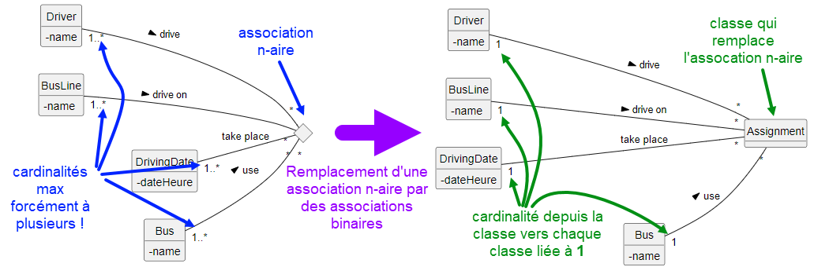

ifndef::_main_loaded[]
include::../config/load_attributes.adoc[]
endif::_main_loaded[]
//titre de la section
[[association_n_aire]]
= L'association n-aire
ifndef::_main_loaded[]
include::../config/header_attributes.adoc[]
{empty}
Point précédent :
link:09-1-la-composition.adoc[La composition]
endif::_main_loaded[]

== Qu'est-ce qu'une association n-aire ?

Jusqu'à maintenant, nous n'avons abordé que des relations entre deux classes.
Cela couvre la très grande majorité des cas mais parfois, 3 classes ou plus peuvent être liées entre elles.

Une [[keyword_relation_n_aire]]*[.keyword]#((relation n-aire))#* est une relation entre au moins 3 classes (jusqu’à maintenant, il s’agissait de relations binaires).
Les cas d’utilisation sont rares, ou plutôt rarement pertinents car il n’est pas rare de trouver des relations n-aires qui n’en sont pas.
Chaque instance de l’association est un tuple de valeurs provenant chacune de leur classe respective.
Ce n'est pas facile à comprendre, j'en conviens.

Je vais expliquer ce concept en m'appuyant sur un cas qui va évoluer progressivement.

Imaginons que nous devions modéliser des chauffeurs qui conduisent des bus de ville sur des lignes de bus.

Nous avons 3 classes à modéliser :

ifeval::[{_show_plantuml} == 1]
[plantuml,format=svg,role=class]
....
hide circle
skinparam classAttributeIconSize 0
hide members

class Driver
class Bus
class BusLine
....
//_show_plantuml
endif::[]

Nous savons qu'un chauffeur ne conduit pas toujours le même bus et qu'un bus peut être conduit par plusieurs chauffeurs.
Cela donne la modélisation suivante :

ifeval::[{_show_plantuml} == 1]
[plantuml,format=svg,role=class]
....
hide circle
skinparam classAttributeIconSize 0
hide members

class Driver
class BusLine
Driver "*" -- "*" Bus : drive >
....
//_show_plantuml
endif::[]

Un chauffeur conduit sur des lignes de bus.
Nous pourrions être tentés de modéliser la solution suivante :

ifeval::[{_show_plantuml} == 1]
[plantuml,format=svg,role=class]
....
hide circle
skinparam classAttributeIconSize 0
hide members

left to right direction
class Driver
class BusLine
Driver "*" -- "*" Bus : drive >
Driver "*" -- "*" BusLine : drive on >
....
//_show_plantuml
endif::[]

Et de continuer en indiquant qu'un bus circule sur une ligne de bus qui n'est pas toujours la même :

ifeval::[{_show_plantuml} == 1]
[plantuml,format=svg,role=class]
....
hide circle
skinparam classAttributeIconSize 0
hide members

left to right direction
class Driver
class BusLine
Driver "*" -- "*" Bus : drive >
Driver "*" -- "*" BusLine : drive on >
Bus "*" -- "*" BusLine : use >
....
//_show_plantuml
endif::[]

Cependant, cette modélisation conduit à ne connaître que les couples Driver/Bus, Driver/BusLine, Bus/BusLine.

Nous allons utiliser notre diagramme de classes pour mettre en avant la limite de ce qu'il conceptualise.
Pour cela, nous allons faire évoluer un diagramme d'objets à partir de phrases simples qui s'appuient sur notre dernier diagramme de classes.

* Michel conduit le bus B sur la ligne 1 :
+
ifeval::[{_show_plantuml} == 1]
[plantuml,target=n-aire-pb-1,format=svg]
....
hide circle
skinparam classAttributeIconSize 0

object "Michel: Driver" as Michel
object "bus B: Bus" as BusB
object "ligne 1: BusLine" as L1

left to right direction
Michel -[#blue]- BusB
BusB -[#blue]- L1

....
//_show_plantuml
endif::[]

* Paul conduit le bus B sur la ligne 2
+
ifeval::[{_show_plantuml} == 1]
[plantuml,target=n-aire-pb-2,format=svg]
....
hide circle
skinparam classAttributeIconSize 0

object "Michel: Driver" as Michel
object "bus B: Bus" as BusB
object "ligne 1: BusLine" as L1

object "Paul: Driver" as Paul
object "ligne 2: BusLine" as L2

left to right direction
Michel -- BusB
BusB -- L1

Paul -[#blue]- BusB
BusB -[#blue]- L2

....
//_show_plantuml
endif::[]

A ce stade, il n'est plus possible de savoir sur quelle ligne de bus Paul a conduit le bus B car ce bus est lié à deux lignes.
Mais, notre diagramme de classes de tout à l'heure nous montre qu'il y a une association entre `Driver` et `BusLine`.
Nous pouvons donc associer la ligne de bus au chauffeur :

* Michel a conduit sur la ligne 1 et Paul sur la 2
+
ifeval::[{_show_plantuml} == 1]
[plantuml,target=n-aire-pb-3,format=svg]
....
hide circle
skinparam classAttributeIconSize 0

object "Michel: Driver" as Michel
object "bus B: Bus" as BusB
object "ligne 1: BusLine" as L1

object "Paul: Driver" as Paul
object "ligne 2: BusLine" as L2

left to right direction
Michel -- BusB
BusB -- L1

Paul -- BusB
BusB -- L2

Michel -[#blue]- L1
Paul -[#blue]- L2

....
//_show_plantuml
endif::[]

On peut maintenant affirmer que Michel a conduit le bus B et qu'il l'a fait sur la ligne 1.
Mais que se passe-t-il s'il doit conduire le bus B sur la ligne 2 ?

* Michel conduit également le bus B sur la ligne 2
+
ifeval::[{_show_plantuml} == 1]
[plantuml,target=n-aire-pb-4,format=svg]
....
hide circle
skinparam classAttributeIconSize 0

object "Michel: Driver" as Michel
object "bus B: Bus" as BusB
object "ligne 1: BusLine" as L1

object "Paul: Driver" as Paul
object "ligne 2: BusLine" as L2

left to right direction
Michel -[#blue]- BusB
BusB -- L1

Paul -- BusB
BusB -- L2

Michel -- L1
Michel -[#blue]- L2
Paul -- L2

....
//_show_plantuml
endif::[]

Il reste encore possible de dire que Michel a conduit le bus B sur les lignes 1 et 2.

* Maintenant, prenons en compte le fait que Michel et Paul conduisent un bus C sur les lignes 1 et 2 :
+
ifeval::[{_show_plantuml} == 1]
[plantuml,target=n-aire-pb-5,format=svg]
....
hide circle
skinparam classAttributeIconSize 0

object "Michel: Driver" as Michel
object "bus B: Bus" as BusB
object "ligne 1: BusLine" as L1

object "Paul: Driver" as Paul
object "ligne 2: BusLine" as L2

object "bus C: Bus" as BusC

left to right direction
Michel -- BusB
BusB -- L1

Paul -- BusB
BusB -- L2

Michel -- L1
Michel -- L2
Paul -- L2

Michel -[#blue]- BusC
Paul -[#blue]- BusC

BusC -[#blue]- L1
BusC -[#blue]- L2
....
//_show_plantuml
endif::[]

Nous sommes coincés maintenant !
Il n'est plus possible de savoir sur quelles lignes ont été conduit chaque bus.

Lorsque l'on navigue d'un objet à l'autre, voici que l'on peut avancer :

* On peut dire que Michel conduit les bus B et C. (association Driver/Bus) +
* On peut dire que Michel conduit sur les lignes 1 et 2 (association Driver/LineBus) +
* On  peut dire que le bus B circule sur les lignes 1 et 2 (association Bus/BusLine) +

Voici ce que l'on ne peut pas affirmer :

* Michel conduit le bus B sur la ligne 1
(effectivement, le bus B est lié à 2 lignes, cela ne veut pas dire que Michel à conduit sur la ligne 1.
Ce peut être Paul)

* La ligne 2 est utilisée par Paul avec le bus B
(effectivement, la ligne 2 est liée au bus B mais c'est peut être Paul qui conduisait).

S'il n'est pas possible de déterminer qui à conduit tel bus sur telle ligne, alors la modélisation proposée n'est pas bonne.
Nous avons besoin de connaître "en même temps" le chauffeur, le bus qu'il utilise et la ligne sur laquelle il roule.
Pour cela il faut "associer" les 3 classes ensembles.

La solution est *d'associer* `Driver` / `BusLine` et `Bus`, de les lier ensemble.
Lorsque l'on associe / relie trois classes, on parle d'*((association ternaire))*.

Voici la modélisation qui permet de savoir que Michel a conduit le bus B sur la ligne 1 :

ifeval::[{_show_plantuml} == 1]
[plantuml,format=svg,role=class]
....
hide circle
skinparam classAttributeIconSize 0
hide members

class Driver
class BusLine

<> ternaire
Driver "1..*" --- "*" ternaire : drive >
BusLine "1..*" --- "*" ternaire : drive on >
Bus "1..*" -- "*" ternaire : use >
....
//_show_plantuml
endif::[]

NOTE: Vous remarquerez les cardinalités minimales à 1. +
Il ne peut y avoir une association alors qu'il manquerait un chauffeur ou la ligne de bus ou encore le bus.

[TIP]
====
Si vous avez des difficultés à comprendre la représentation avec le losange carré, imaginez qu'une association binaire soit représentée comme ceci : 

ifeval::[{_show_plantuml} == 1]
[plantuml,target=association-binaire-avec-symbole-diamond,format=svg]
....
hide circle
skinparam classAttributeIconSize 0

Class Bus

diamond symbolAssociation

left to right direction
Bus -[#blue]- symbolAssociation
symbolAssociation -[#blue]- BusLine

....
//_show_plantuml
endif::[]

Lorsqu'une association concerne une troisième classe, il  faut relier cette classe au symbol de l'association :

ifeval::[{_show_plantuml} == 1]
[plantuml,target=association-ternaire-avec-symbole-diamond,format=svg]
....
hide circle
skinparam classAttributeIconSize 0

Class Bus

diamond symbolAssociation

left to right direction
Bus -- symbolAssociation
symbolAssociation -- BusLine
symbolAssociation -[#blue]- Driver

....
//_show_plantuml
endif::[]

====

Il subsiste encore un manque.
Michel sait qu'il doit conduire le bus B sur la ligne 3, mais c'est aussi le cas pour d'autres chauffeurs.
Il faut donc pouvoir préciser "quand" chacun d'eux va conduire le bus B sur la ligne 3.
La solution consiste à ajouter un objet date à l'association ternaire :

ifeval::[{_show_plantuml} == 1]
[plantuml,format=svg,role=class]
....
hide circle
skinparam classAttributeIconSize 0
hide methods

class Driver {
-name
}
class BusLine {
-name
}
class DrivingDate #pink {
-dateHeure
}

class Bus {
-name
}

<> ternaire
Driver "1..*" --- "*" ternaire : drive >
BusLine "1..*" --- "*" ternaire : drive on >
Bus "1..*" -- "*" ternaire : use >
'left to right direction
left to right direction
DrivingDate "1..*" -[#blue]- "*" ternaire : take place
....
//_show_plantuml
endif::[]

Grâce à cette association, il est possible de savoir qui à conduit quoi, où et quand !

[WARNING]
====
L'association n-aire est difficile à interpréter et régulièrement source d'erreurs.
Une fois la conceptualisation réalisée, il est préférable de remplacer ce type d'association par des associations binaires.
Ainsi, l'association est remplacée par une agrégation :

ifeval::[{_show_plantuml} == 1]
[plantuml,format=svg,role=class]
....
hide circle
skinparam classAttributeIconSize 0
hide methods

class Driver {
-name
}
class BusLine {
-name
}
class DrivingDate #pink {
-dateHeure
}

class Bus {
-name
}

class Assignment
Driver "1" ---o "*" Assignment : drive >
BusLine "1" ---o "*" Assignment : drive on >
Bus "1" --o "*" Assignment : use >
left to right direction
DrivingDate "1" ---o "*" Assignment : take place

note as N1
La classe qui remplace l'association est
liée à chaque classe par un lien binaire.
Remarquez la cardinalité à 1 pour chaque
classe liée à la classe qui remplace
l'association.
end note
....
//_show_plantuml
endif::[]

La conséquence est qu'il ne reste plus que des associations binaires que nous savons traiter.
====

== Implémentation d'une association n-aire

Je conseille plus que vivement de remplacer une association n-aire par une classe qui va être liée aux autres par des associations binaires (vous remarquerez que je n'ai pas utilisé le losange indiquant l'agrégation, c'est rarement utilisé dans la pratique même si c'est plus pertinent):

NOTE: Les ORM tels que Doctrine nécessite d'ailleurs de passer par des associations binaires.

Une fois que vous n'avez plus que des associations binaires, il n'y a qu'à réaliser les implémentations comme nous l'avons appris jusqu'à maintenant.
Il n'y a rien de nouveau à aborder sur ce point.

== Exercice

[.question]
****
*Q{counter:_question})*
Un cinéma vous commande la conceptualisation de ses projections afin de faire développer un logiciel de gestion des séances à planifier.

Réalisez le diagramme de classes qui permet de savoir pour chaque séance, le film et la salle concernée.
****

ifeval::[{_show_correction} == 1]
[.answer]
****
_Correction de Q{_question}_

ifeval::[{_show_plantuml} == 1]
[plantuml,format=svg,role=class]
....
hide circle
skinparam classAttributeIconSize 0

class Movie

<> session

Room "*" -- session
Movie "*" -- session
DateSession "*" -- session
....
//_show_plantuml
endif::[]
Un film est projeté plusieurs fois dans une même salle. Il faut pouvoir distinguer les projections entre elles. Cela est rendu possible avec `DateSession`.

On remplace l'association ternaire par des associations binaires :

ifeval::[{_show_plantuml} == 1]
[plantuml,format=svg,role=class]
....
hide circle
skinparam classAttributeIconSize 0

class Movie

class Session

Room "1" -- "*" Session
Movie "1" -- "*" Session
DateSession "1" -- "*" Session
....
//_show_plantuml
endif::[]
****
//_show_correction
endif::[]

ifndef::_main_loaded[]
Point suivant :
link:05-1-l-association-porteuse.adoc[L'association porteuse (ou classe association)]
include::../config/index.adoc[]
endif::_main_loaded[]