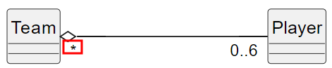

ifndef::_main_loaded[]
include::../config/load_attributes.adoc[]
endif::_main_loaded[]
//titre de la section
[[l_agrégation]]
= L'agrégation
ifndef::_main_loaded[]
include::../config/header_attributes.adoc[]
{empty}
Point précédent :
link:06-1-association_reflexive.adoc[L'association réflexive]
endif::_main_loaded[]

== Qu'est-ce qu'une agrégation ?

NOTE: Rappel : l'association traduit un lien entre deux objets.

Le terme d'agrégation signifie l'action d'agréger, d'unir en un tout.

L'[[keyword_agrégation]]*[.keyword]#((agrégation))#* exprime la construction d'un objet à partir d'autres objets.
Cela se distingue de la notion d'association que nous avons abordée jusqu'à maintenant.
Effectivement, l'association traduit un lien entre deux objets alors que l'agrégation traduit le "regroupement" ou "l'assemblage" de plusieurs objets.
Le lien exprimé est donc plus fort que pour une association.

Imaginez des pièces de Légo que vous utilisez pour construire une maison.
Chaque pièce est un objet qui une fois agrégée avec les autres pièces permettent d'obtenir un autre objet (la maison).
Il est tout à fait possible d'utiliser chaque pièce pour faire une autre construction.
Détruire la maison ne détruit pas les pièces.

Implicitement, l’agrégation signifie « contient », « est composé de ».
C’est pour cela qu’on ne la nomme pas sur le diagramme UML.

Autrement dit, une agrégation est le regroupement d'un ou plusieurs objets afin de construire un objet « complet » nommé [[keyword_agrégat]]*[.keyword]#((agrégat))#*.

Représentons le lien entre une équipe et les joueurs qui composent celle-ci (ici une équipe de volley) :

ifeval::[{_show_plantuml} == 1]
[plantuml,target=team_zeroone_to_six_player_agregation_,format=svg]
....
hide circle
skinparam classAttributeIconSize 0

left to right direction
Team "0..1" o-- "0..6" Player

note as N
Une équipe est composée de 6 joueurs.
Un joueur compose 0 ou une équipe.
end note
....
//_show_plantuml
endif::[]

Le losange vide est le symbole qui caractérise une agrégation.
Il est placé du côté de l'agrégat (l'objet qui est composé / assemblé).

La classe `Team` est l'*agrégat* (le composé de) alors que la classe `Player` est le [[keyword_composant]]*[.keyword]#((composant))#*.

Ce diagramme objet représente les joueurs qui composent une équipe de volley

ifeval::[{_show_plantuml} == 1]
[plantuml,format=svg,role=class]
....
hide circle
skinparam classAttributeIconSize 0

object "equipe1: Team" as T1

object "clem: Player" as Clem
object "sofian: Player" as Sofian
object "aurel: Player" as Aurel
object "olivier: Player" as Olivier
object "cedric: Player" as Cedric
object "jalila: Player" as Jalila

T1 -- Sofian
T1 -- Clem
T1 -- Aurel
T1 -- Olivier
T1 -- Cedric
T1 -- Jalila
....
//_show_plantuml
endif::[]

(((Caractéristiques d'une agrégation)))
[IMPORTANT]
====
Une agrégation présente les caractéristiques suivantes :

* L'agrégation est composée d'"éléments".
* Ce type d'association est non symétrique.
Il n'est pas possible de dire "Une équipe est composée de joueurs et un Joueur est composé d'une équipe"
* <<composants_partageables, les composants de l'agrégation sont *partageables*>>
* <<cycle_de_vie, l'agrégat et les composants ont leur *propre cycle de vie*>>)
====

*Les composants sont partageables :* [[composants_partageables]]

La particularité d'une agrégation est que *le composant peut être partagé*.

Par exemple, un joueur d'une équipe peut jouer (se partager) dans d'autres équipes :

ifeval::[{_show_plantuml} == 1]
[plantuml,format=svg,role=class]
....
hide circle
skinparam classAttributeIconSize 0

left to right direction
Team "*" o-- "0..6" Player

note bottom of Team : agrégat
note bottom of Player : composant

note as N
Une équipe est composé de 6 joueurs.
Un joueur compose 0 à plusieurs équipes.
end note
....
//_show_plantuml
endif::[]

Voici un diagramme objet pour illustrer ce partage :

ifeval::[{_show_plantuml} == 1]
[plantuml,format=svg,role=class]
....
hide circle
skinparam classAttributeIconSize 0

left to right direction
object "equipe1: Team" as T1
object "equipe2: Team" as T2

object "clem: Player" as Jean
object "sofian: Player" as Sofian
object "aurel: Player" as Aurel

T1 -- Jean
T1 -- Aurel

T2 -- Jean
T2 -- Sofian
T2 -- Aurel
....
//_show_plantuml
endif::[]

Les instances de `Player` "aurel" et "clem" sont *partagées* dans deux équipes. Celle représentant "sofian" n'est pas partagée mais peut l'être à un moment donné.

Voici un autre exemple :

ifeval::[{_show_plantuml} == 1]
[plantuml,format=svg,role=class]
....
hide circle
skinparam classAttributeIconSize 0

hide circle
skinparam classAttributeIconSize 0
hide members

left to right direction
class Person

Person "0..*" ---o "1..*" Enterprise
Enterprise "1..*" o--- "0..*" Local

....
//_show_plantuml
endif::[]

L'entreprise est la réunion en un tout de personnes et de locaux. Les personnes qui composent une entreprise peuvent travailler dans d'autres et un local peut servir à plusieurs entreprises. Nous retrouvons la notion de partage des composants.

[WARNING]
====
Comme les composants sont partageables, la multiplicité du côté de l'agrégat peut être supérieur à 1.

====

*L'agrégat et les composants ont leur propre cycle de vie* [[cycle_de_vie]]

NOTE: Le cycle de vie d'un objet désigne sa création, ses changements d'état jusqu'à sa destruction.

* Un agrégat *peut* exister sans ses composants.
(en programmation, il doit être possible d'instancier un agrégat sans ses composants) +
Une équipe peut exister même s'il elle n'a aucun joueur.

* Un composant *peut* exister sans être utilisé par l'agrégat.
(en programmation, il doit être possible d'instancier un composant sans que l'agrégat l'utilise ou existe)

* la destruction de l'agrégat ne détruit pas ses composants (et vice versa) ce qui va dans le sens des deux points précédents

== Navigabilité et agrégation

Tout ce que nous avons vu dans la <<la_navigabilité_d_une_association, partie sur la navigabilité>> s'applique dans le cadre d'une agrégation.

ifeval::[{_show_plantuml} == 1]
[plantuml,format=svg,role=class]
....
hide circle
skinparam classAttributeIconSize 0

hide circle
skinparam classAttributeIconSize 0
hide members

left to right direction
class Person

Person "0..*" ---o "1..*" Enterprise
Enterprise "1..*" o---> "0..*" Local

....
//_show_plantuml
endif::[]

Il y a navigabilité bidirectionnelle entre `Person` et `Enterprise` et navigabilité unidirectionnelle de `Enterprise` vers `Local`.

== Implémentation d'une agrégation

L'implémentation d'une agrégation est exactement la même qu'une association classique.

L'agrégation permet seulement d'exprimer conceptuellement le fait que les instances d'une classe sont des "assemblages" d'autres instances de classe.
Une conceptualisation est une représentation de la réalité.
Cela peut aider à mieux cerner la logique métier de l'application.

ifndef::_main_loaded[]
Point suivant : 
link:09-1-la-composition.adoc[La composition]
include::../config/index.adoc[]
endif::_main_loaded[]
