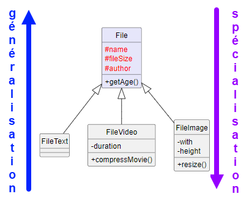

ifndef::_main_loaded[]
include::../config/load_attributes.adoc[]
endif::_main_loaded[]
//titre de la section
[[la_relation_d_héritage_classe_mère_classe_fille_]]
= La relation d'héritage (classe mère, classe fille)
ifndef::_main_loaded[]
include::../config/header_attributes.adoc[]
{empty}
Point précédent :
link:10-1-la-relation-de-dependance.adoc[La relation de dépendance]
endif::_main_loaded[]

ifndef::_hide_breakpoint[]
//todo: breakpoint à supprimer
:breakpoint_date: mer. 15/02 à 15:42
//on masque la correction à partir de ce point
:_show_correction: 0
#Point d'arrêt du cours au mer. 15/02 à 15:42#
endif::_hide_breakpoint[]

== Comprendre et modéliser la notion d'héritage
La [[keyword_relation_d_héritage]]*[.keyword]#((relation d'héritage))#* n'exprime plus l'idée qu'un objet A est lié à un objet B mais qu'*un objet A est un objet B*.

Imaginons que nous devions gérer des fichiers dans une application de gestion électronique des documents.
La première chose est de créer la classe `File` :

ifeval::[{_show_plantuml} == 1]
[plantuml,format=svg,role=class]
....
hide circle
skinparam classAttributeIconSize 0
hide members

class File {

}
....
//_show_plantuml
endif::[]

Les types de fichiers à gérer sont les suivants :

* fichier texte avec un nom et une taille en Mo.
* fichier image avec un nom, une taille en Mo et des dimensions en pixels.
Une image peut être redimensionnée.
* fichier vidéo avec un nom, une taille, une durée.
Une vidéo peut être compressée.

Nous pouvons prendre en compte ces informations dans le diagramme suivant :

ifeval::[{_show_plantuml} == 1]
[plantuml,format=svg,role=class]
....
hide circle
skinparam classAttributeIconSize 0

class File {
    -name
    -fileSize
    -with
    -height
    -duration
    +resize()
    +compressMovie()
}

....
//_show_plantuml
endif::[]

Cette classe soulève plusieurs remarques :

* Certains attributs et ou certaines méthodes sont inutiles en fonction du type de fichier.
Un fichier texte ne peut pas être redimensionné ou subir une compression vidéo, une image n'a pas de durée, etc.
* Dès qu'il faut ajouter une nouvelle caractéristique (par exemple, le format d'affichage d'une image : portrait ou paysage), il faut faire évoluer la classe `File`. +
Elle va devenir de plus en plus "grosse" et poser un problème de maintenance évolutive (et peut être devenir un https://https://fr.wikipedia.org/wiki/God_object[God object]).

Le principe général en programmation est de "diviser pour régner".
Dans notre cas, cela signifie qu'il faut que chaque type de fichier ait sa propre classe :

Voici comment illustrer ce principe :

ifeval::[{_show_plantuml} == 1]
[plantuml,format=svg,role=class]
....
hide circle
skinparam classAttributeIconSize 0

class FileText {
    -name
    -fileSize
}
class FileVideo {
    -name
    -fileSize
    -duration
    +compressMovie()
}
class FileImage {
    -name
    -fileSize
    -with
    -height
    +resize()
}

....
//_show_plantuml
endif::[]

Maintenant, s'il faut ajouter le type d'affichage (portrait ou paysage) d'une image, il est facile de cibler la classe à faire évoluer sans "polluer" les autres avec des attributs ou méthodes qui leur seraient inutiles.

Par contre, si l'on souhaite ajouter l'auteur du fichier, il faut le faire dans les 3 classes.
S'il faut ajouter une méthode qui retourne l'âge du fichier, il faut le faire dans chaque classe.
Si l'implémentation de cette méthode évolue, il faudra faire la mise à jour dans les 3 classes.
Tout cela va vite devenir difficile à maintenir.
Toutefois, si l'on passe outre ces remarques, cela donne le diagramme suivant :

ifeval::[{_show_plantuml} == 1]
[plantuml,format=svg,role=class]
....
hide circle
skinparam classAttributeIconSize 0

class FileText {
    -name
    -fileSize
    <color:#blue>-author
    <color:#blue>+getAge()
}
class FileVideo {
    -name
    -fileSize
    -duration
    <color:#blue>-author
    +compressMovie()
    <color:#blue>+getAge()

}
class FileImage {
    -name
    -fileSize
    -with
    -height
    <color:#blue>-author
    +resize()
    <color:#blue>+getAge()
}

....
//_show_plantuml
endif::[]

Le problème de cette approche est que nous nous répétons.
Il y a un autre grand principe en programmation, c'est le principe https://https://fr.wikipedia.org/wiki/Ne_vous_r%C3%A9p%C3%A9tez_pas[DRY] (don't repeat yourself => ne vous répéter pas). Dans le cas présent, ce principe n'est clairement pas respecté.

L'idéal serait de mettre dans une classe les attributs et les méthodes communes aux 3 classes et de laisser ce qui est spécifique dans les classes précédemment créées.

Pour cela il faut repérer tous les attributs communs et les méthodes communes :

ifeval::[{_show_plantuml} == 1]
[plantuml,format=svg,role=class]
....
hide circle
skinparam classAttributeIconSize 0

class FileText {
     <color:#red>-name
     <color:#red>-fileSize
    <color:#red>-author
    <color:#red>+getAge()
}
class FileVideo {
     <color:#red>-name
     <color:#red>-fileSize
    -duration
    <color:#red>-author
    +compressMovie()
    <color:#red>+getAge()

}
class FileImage {
     <color:#red>-name
     <color:#red>-fileSize
    -with
    -height
    <color:#red>-author
    +resize()
    <color:#red>+getAge()
}

note "Les attributs communs et les méthodes\ndoivent être identifiés et placés\ndans une classe qui va les regrouper" as N

....
//_show_plantuml
endif::[]

Après regroupement :

ifeval::[{_show_plantuml} == 1]
[plantuml,format=svg,role=class]
....
hide circle
skinparam classAttributeIconSize 0

class File  #lavender {
    <color:#red>-name
    <color:#red>-fileSize
    <color:#red>-author
    <color:#red>+getAge()
}
left to right direction
class FileText {
}
class FileVideo {
    -duration
    +compressMovie()
}
class FileImage {
    -with
    -height
    +resize()
}

note right of File
    Cette classe regroupe les attributs
    communs et les méthodes communes
    aux autres classes.
    Le nom de classe retenu se
    veut <b>générique</b> (File).
    Un fichier peut être un fichier texte,
    un fichier vidéo ou un fichier image.
end note

note "Nos 3 classes sont allégées.\nIl n'y a plus de redondance de\ncode." as N

....
//_show_plantuml
endif::[]

A ce stade, comment savoir que nos 3 classes possèdent les attributs et méthodes de la classe `File` ?

C'est là qu'intervient la *relation d'héritage*.

UML nous permet de dire qu'un fichier texte *est un* fichier, qu'un fichier vidéo *est un* fichier et enfin qu'un fichier image *est un* fichier.

Sur le diagramme de classes, cela se traduit par une *flèche du côté de la classe qui regroupe les attributs communs et méthodes communes* :

ifeval::[{_show_plantuml} == 1]
[plantuml,format=svg,role=class]
....
hide circle
skinparam classAttributeIconSize 0

class File  #lavender {
    <color:#red>-name
    <color:#red>-fileSize
    <color:#red>-author
    <color:#red>+getAge()
}
'left to right direction
class FileText {
}
class FileVideo {
    -duration
    +compressMovie()
}
class FileImage {
    -with
    -height
    +resize()
}
FileText -up-|> File
FileImage -up-|> File
FileVideo -up-|> File

note left of File
    <b>classe mère</b>
    ou classe de base
    ou super classe
end note

note "<b>classes filles</b>\nou classe dérivée\nou sous classe" as N

FileText .. N
FileImage .. N
FileVideo .. N

....
//_show_plantuml
endif::[]

Il y a un problème majeur dans cette modélisation.
Les attributs sont déclarés comme privés.
Ils ne peuvent être utilisés à l'extérieur de la classe dans laquelle ils sont déclarés.
Pour permettre leur utilisation à l'extérieur, il faut les déclarer comme protégés avec le caractère `#`.
Attention, il ne faut pas les déclarer avec une visibilité publique sinon le principe d'encapsulation n'est plus respecté.

Voici le diagramme corrigé :

ifeval::[{_show_plantuml} == 1]
[plantuml,format=svg,role=class]
....
hide circle
skinparam classAttributeIconSize 0

class File  #lavender {
    <color:#red>#name
    <color:#red>#fileSize
    <color:#red>#author
    +getAge()
}
class FileText {
}
class FileVideo {
    -duration
    +compressMovie()
}
class FileImage {
    -with
    -height
    +resize()
}
FileText -up-|> File
FileImage -up-|> File
FileVideo -up-|> File
....
//_show_plantuml
endif::[]

[IMPORTANT]
====
La classe qui regroupe les attributs communs et méthodes communes est appelée la [[keyword_classe_mère]]*[.keyword]#((classe mère))#* (ou [[keyword_super_classe]]*[.keyword]#((super classe))#* ou [[keyword_classe_de_base]]*[.keyword]#((classe de base))#*).
La ou les classes qui contiennent des attributs spécifiques / spécialités sont des [[keyword_classes_filles]]*[.keyword]#((classes filles))#* (ou [[keyword_classes_dérivées]]*[.keyword]#((classes dérivées))#* ou [[keyword_sous_classes]]*[.keyword]#((sous classes))#*)

Il est dit que *les classes filles héritent de la classe mère*.
C'est-à-dire que les classes filles peuvent utiliser les attributs et méthodes de la classe mère si leur visibilité est au moins protégée.

Lorsque l'on remonte d'une classe fille vers la classe mère (donc que l'on factorise les attributs et les méthodes en commun), on parle de [[keyword_généralisation]]*[.keyword]#((généralisation))#*.

Lorsque l'on descend de la classe mère vers les classes filles (donc lorsque l'on spécialise certains attributs ou méthodes qui ne concernent qu'une classe), on parle de [[keyword_spécialisation]]*[.keyword]#((spécialisation))#*.

====

Le gros avantage de l'héritage est de pouvoir faire évoluer rapidement une application.

Imaginons que nous ayons besoin de savoir si un fichier est top secret ou pas.
Cette caractéristique concerne tous les fichiers.
Il n'y a qu'à ajouter cet attribut dans la classe mère et le travail est terminé !

Comme ceci :

ifeval::[{_show_plantuml} == 1]
[plantuml,format=svg,role=class]
....
hide circle
skinparam classAttributeIconSize 0

class File  #lavender {
    #name
    #fileSize
    #author
    <color:#red>#isSecret
    +getAge()
}
class FileText {
}
class FileVideo {
    -duration
    +compressMovie()
}
class FileImage {
    -with
    -height
    +resize()
}
FileText -up-|> File
FileImage -up-|> File
FileVideo -up-|> File
....
//_show_plantuml
endif::[]

Puisque l'attribut ajoutée l'est dans la classe mère, cela signifie que l'on a fait de la *généralisation*.

Si nous devons ajouter une méthode qui indique que le fichier est peut être obsolète car il a plus de 12 mois, l'ajout d'une méthode `isObsolete()` dans la classe mère suffit pour qu'elle soit utilisable dans les classes filles :

ifeval::[{_show_plantuml} == 1]
[plantuml,format=svg,role=class]
....
hide circle
skinparam classAttributeIconSize 0

class File  #lavender {
    #name
    #fileSize
    #author
    #isSecret
    +getAge()
    <color:#red>+isObsolete()
}
class FileText {
}
class FileVideo {
    -duration
    +compressMovie()
}
class FileImage {
    -with
    -height
    +resize()
}
FileText -up-|> File
FileImage -up-|> File
FileVideo -up-|> File
....
//_show_plantuml
endif::[]

Puisque la méthode ajoutée l'est dans la classe mère, cela signifie que l'on a fait de la *généralisation*.

Si l'on doit ajouter la possibilité qu'un fichier retourne un nombre de pages, cela ne concerne que les fichiers texte.
La classe mère n'est pas impactée, seule la classe `FileText` est concernée :

ifeval::[{_show_plantuml} == 1]
[plantuml,format=svg,role=class]
....
hide circle
skinparam classAttributeIconSize 0

class File  #lavender {
    #name
    #fileSize
    #author
    #isSecret
    +getAge()
    +isObsolete()
}
class FileText {
    <color:#red>-nbPages
}
class FileVideo {
    -duration
    +compressMovie()
}
class FileImage {
    -with
    -height
    +resize()
}
FileText -up-|> File
FileImage -up-|> File
FileVideo -up-|> File
....
//_show_plantuml
endif::[]

Puisque l'attribut ajouté l'est dans la classe fille, cela signifie que l'on a fait de la *spécialisation*.

== Implémentation de la relation d'héritage

L'implémentation de l'héritage est très simple :

* Il faut implémenter les attributs communs et les méthodes communes aux classes filles (avec une visibilité protégée) dans la classe mère.
* Il faut implémenter chaque classe fille avec leurs attributs spécialisés et méthodes spécialisées.
* Il faut indiquer pour chaque classe fille le nom de la classe mère dont elle hérite

Je simplifie le diagramme pour avoir moins de code à implémenter :

ifeval::[{_show_plantuml} == 1]
[plantuml,format=svg,role=class]
....
hide circle
skinparam classAttributeIconSize 0

class File {
    #name
    #isSecret
    +isObsolete()
}
class FileText {
}

class FileImage {
    -with
    -height
    +resize()
}
FileText -up-|> File
FileImage -up-|> File
....
//_show_plantuml
endif::[]

Commençons par la classe mère `File`:

[source,php]
----
include::../assets/source_code/implementation-heritage.php[tags=file_class]
----

Voici le code de la sous classe `FileText` :

[source,php]
----
include::../assets/source_code/implementation-heritage.php[tags=filetext_class]
----
<1> Bien indiqué que la classe hérite de `File` via le mot clé `extends` (pour PHP)
<2> Bien lire l'information à propos du constructeur.
Il est inutile de le prévoir car celui de la classe mère sera appelé automatiquement.

Et enfin le code de la sous classe `FileImage` :

[source,php]
----
include::../assets/source_code/implementation-heritage.php[tags=fileimage_class]
----
<1> Bien indiqué que la classe hérite de `File` via le mot clé `extends` (pour PHP)

Pour bien, comprendre, nous allons créer un fichier texte et un fichier image.
Nous allons ensuite appeler soit des méthodes issues de la classe mère depuis une classe fille, soit appeler des méthodes spécialisées.

[source,php]
----
include::../assets/source_code/implementation-heritage.php[tags=mise_en_oeuvre_heritage]
----

L'autre avantage de l'héritage, c'est que si un nouveau type de fichier qui n'est pas géré par l'application doit être manipulé, on peut le faire grâce à la classe `File` car elle est générique (n'importe quel type de fichier est ... un fichier).

Si nous devons gérer un fichier de type exécutable, aucune des sous classes ne correspond.
Soit on crée un nouveau sous-type (mais ce doit être une volonté clairement établie), soit on utilise le type `File` qui convient à tous les types de fichiers :

[source,php]
----
include::../assets/source_code/implementation-heritage.php[tags=fichier_executable]
----

[NOTE]
====
Nous voyons tout l'intérêt de pouvoir utiliser la classe mère pour gérer des sous types qui ne sont pas pris en charge par l'application.
====

== Point technique (en PHP)

Si vous avez compris que depuis une instance d'une classe fille, il est possible d'utiliser un membre de la classe mère (attribut ou méthode), il en va de même pour le constructeur (puisque c'est aussi une méthode).

Prenons le diagramme simplifié suivant :

ifeval::[{_show_plantuml} == 1]
[plantuml,target=class-file-construct,format=svg]
....
hide circle
skinparam classAttributeIconSize 0

class File {
+__construct()
}
class FileText {
}
FileText -up-|> File

note as N1
La classe mère a un constructeur.
Les classes filles n'en ont pas.
Elles utiliseront alors celui
de la classe mère.
end note
....
// end _show_plantuml
endif::[]

L'implémentation du diagramme donne le code suivant :

[source%linenums,php]
----
include::../assets/source_code/file_construct_inheritence.php[tags=classes;!filetext_with_construct]
----

Et voici son utilisation et son rendu :

[source%linenums,php]
----
include::../assets/source_code/file_construct_inheritence.php[tags=classes_use]
----
La sortie :

----
Je suis du texte dans le constructeur de la classe File.
Je suis du texte dans le constructeur de la classe File.
----

Il apparaît clairement que le constructeur parent (celui de la classe mère) a été utilisé par la classe fille.
Elle en a hérité.

Maintenant, ajoutons un constructeur dans la classe fille :

ifeval::[{_show_plantuml} == 1]
[plantuml,target=class-file-construct2,format=svg]
....
hide circle
skinparam classAttributeIconSize 0

class File {
+__construct()
}
class FileText {
+__construct()
}
FileText -up-|> File

note as N1
La classe mère a un constructeur.
La classe file a également
un constructeur.
Cela signifie qu'un constructeur
doit être implémenté dans la
classe fille.
end note
....
// end _show_plantuml
endif::[]

[source%linenums,php, highlight=13..17]
----
include::../assets/source_code/file_construct_inheritence.php[tags=classes;!call_parent_construct]
----

Procédons au même appel que tout à l'heure :

[source%linenums,php]
----
include::../assets/source_code/file_construct_inheritence.php[tags=classes_use]
----
La sortie :

----
Je suis du texte dans le constructeur de la classe File.
Appel du constructeur de la classe FileText.
----

Ce comportement est utile lorsque la classe fille doit prévoir un comportement différent de celui de la classe mère tout en utilisant le même nom de méthode.

Il est également possible de profiter du comportement de la classe mère et d'ajouter celui de la classe fille :

[source%linenums,php, highlight=18]
----
include::../assets/source_code/file_construct_inheritence.php[tags=classes]
----
<1> le constructeur parent est appelé depuis le constructeur de la classe fille.

[NOTE]
====
Notre exemple utilise le constructeur mais les remarques sont les mêmes pour n'importe quelle méthode.
Il est possible de [.keyword]#((surcharger une méthode))#  dans la classe fille pour remplacer celle de la classe mère.
Il est possible de faire appel à la méthode de la classe mère (via `parent::nomMethode`) et de la "compléter" depuis la méthode fille.

====

[IMPORTANT]
====
Lorsqu'une méthode "fille" surcharge une méthode mère, il est indispensable de respecter le [.keyword]#((https://fr.wikipedia.org/wiki/Principe_de_substitution_de_Liskov[principe de substitution de Liskov]))#.
Pour faire simple, ce principe préconise que la signature de la méthode "fille" qui surcharge la méthode "mère" soit compatible.
Vous pouvez lire la documentation au sujet des [.keyword]#((https://www.php.net/manual/fr/language.oop5.basic.php#language.oop.lsp[règles de compatibilité de signature]))#.
La [[la_signature_de_la_methode]][.keyword]#((signature d'une méthode))#  est défini par le type de ses paramètres, leur nombre et le type de son retour.
====

[NOTE]
====
Une classe (en PHP) ne peut hériter que d'une seule classe.
L'héritage multiple n'est donc pas possible.
====

L'objectif n'est pas de faire un cours sur la programmation orientée objet.
Effectivement, il reste bien des aspects à aborder concernant l'héritage et les aspects techniques qui en découlent.

== Quelques exercices

[.question]
****
*Q{counter:_question})*
Faites évoluer le diagramme ci-dessous de façon à prendre compte les évolutions suivantes :

* l'application doit prendre en compte un nouveau sous-type pour les fichiers exécutables.
Un fichier exécutable doit disposer d'une méthode `isValidate` qui indique qu'il ne s'agit pas d'un virus.
* l'application doit permettre de gérer des fichiers de type "média".
Ces fichiers sont des fichiers vidéos, des images, des fichiers audio, etc
(il n'est pas attendu de gérer un type "audio").
Un fichier media doit pouvoir être noté avec une note chiffrée.

Diagramme de départ :

ifeval::[{_show_plantuml} == 1]
[plantuml,format=svg,role=class]
....
hide circle
skinparam classAttributeIconSize 0

class File {
    #name
    #fileSize
    #author
    #isSecret
    +getAge()
    +isObsolete()
}
class FileText {
}
class FileVideo {
    -duration
    +compressMovie()
}
class FileImage {
    -with
    -height
    +resize()
}
FileText -up-|> File
FileImage -up-|> File
FileVideo -up-|> File
....
//_show_plantuml
endif::[]
****

ifeval::[{_show_correction} == 1]
[.answer]
****
_Correction de Q{_question}_

ifeval::[{_show_plantuml} == 1]
[plantuml,format=svg,role=class]
....
hide circle
skinparam classAttributeIconSize 0

class File {
    #name
    #fileSize
    #author
    #isSecret
    +getAge()
    +isObsolete()
}
class FileText {
}
class FileVideo {
    -duration
    +compressMovie()
}
class FileImage {
    -with
    -height
    +resize()
}

class FileMedia #pink {
    #note
}

class FileExecutable #pink {
    +isValidate()
}

FileText -up-|> File
FileImage -up-|> FileMedia
FileVideo -up-|> FileMedia
FileMedia -up-|> File
FileExecutable -up-|> File
....
//_show_plantuml
endif::[]
****
//_show_correction
endif::[]

[.question]
****
*Q{counter:_question})*
Implémentez le code des classes qui apparaissent en couleur dans la correction du point précédent sans oublier les éventuelles modifications à apporter aux autres classes.
****

ifeval::[{_show_correction} == 1]
[.answer]
****
_Correction de Q{_question}_

* Il faut implémenter le code des classes `FileExecutable` et `FileMedia`
* Il faut modifier la relation d'héritage des classes `FileVideo` et `FileImage`.

[source,php]
----
include::../assets/source_code/implementation-heritage.php[tags=file_executable_class]
----
[source,php]
----
include::../assets/source_code/implementation-heritage.php[tags=file_media_class]
----

[source,php]
----
//modification de la déclaration de la classe FileVideo
class FileVideo extends FileMedia { //<1>
... //<2>
}

//modification de la déclaration de la classe FileImage
class FileImage extends FileMedia { //<1>
... //<2>
}
----
<1> bien faire attention à hériter de `FileMedia` et non de `File`
<2> le code de la classe qui hérite ne change pas
****
//end _show_correction
endif::[]

[.question]
****
*Q{counter:_question})*
Répondre aux questions qui suivent à partir du diagramme qui a été implémenté à la question précédente

[loweralpha, start=1]
. Quelle classe sera instanciée pour manipuler un fichier csv ?
. Quelle classe sera instanciée pour manipuler un fichier audio ?
. Quelle classe sera instanciée pour manipuler un fichier de type "archive" (.zip, .rar, .jar, ...) ?

//end _question
****

ifeval::[{_show_correction} == 1]
[.answer]
****
_Correction de Q{_question}_

[loweralpha, start=1]
. Pour manipuler un fichier csv (qui est un fichier texte), il faut instancier la classe `FileText`.
. Pour manipuler un fichier audio (qui est un fichier média), il faut instancier la classe `FileMedia` car il n'existe pas de sous-type spécial "audio".
. Pour manipuler un fichier archive, il faut instancier la classe `File` car il n'existe pas de sous-type correspondant.
****
//end _show_correction
endif::[]

ifndef::_main_loaded[]
Point suivant : 
link:12-1-La-relation-abstraite.adoc[La relation abstraite]
include::../config/index.adoc[]
endif::_main_loaded[]

