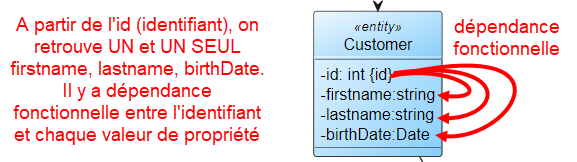
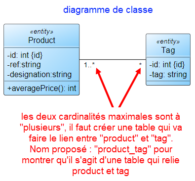
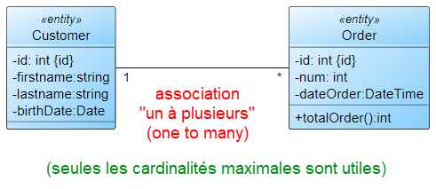
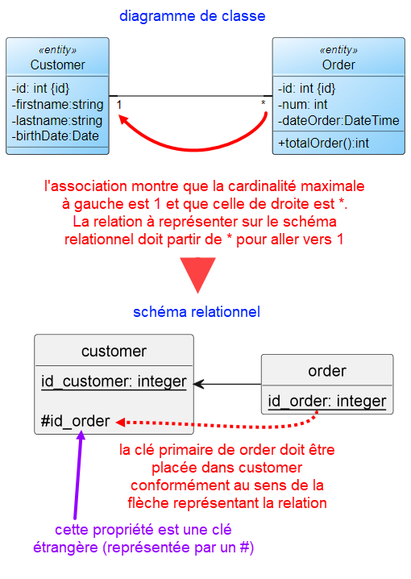
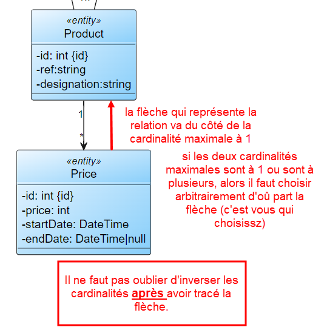
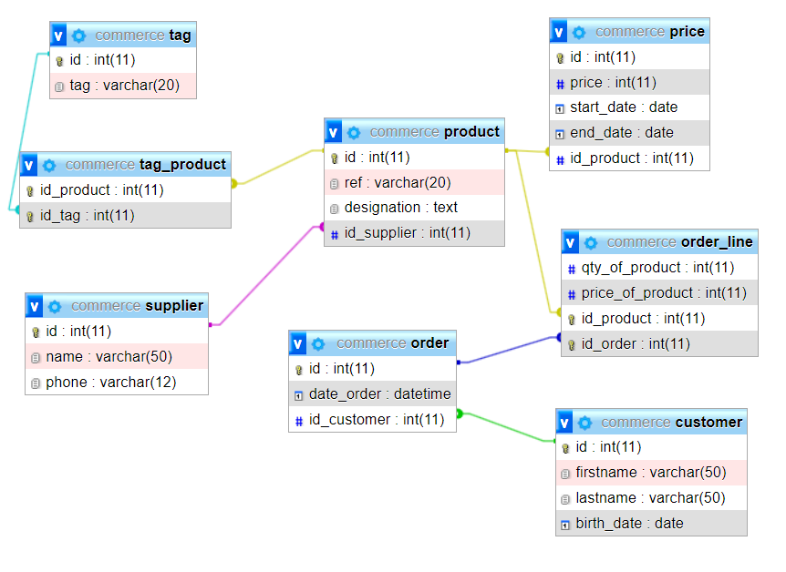

ifndef::_main_loaded[]
include::../config/load_attributes.adoc[]
endif::_main_loaded[]
//titre de la section
[[passer_du_diagramme_de_classe_à_la_bdd]]
= Passer du diagramme de classe à la bdd
ifndef::_main_loaded[]
include::../config/header_attributes.adoc[]
{empty}
Point précédent :
link:13-1-L-interface.adoc[Les interfaces]
endif::_main_loaded[]

[[lien_entre_diagramme_de_classe_et_bdd]]
== Lien entre diagramme de classe et bdd

Le diagramme de classe est utilisé pour modéliser une application.
Certaines classes donnent des instances qui doivent être enregistrée en bdd. Cela s'appelle la [[keyword_persistance_des_données]]*[.keyword]#((persistance des données))#*.
En programmation, ces classes sont appelées des [[keyword_entités]]*[.keyword]#((entités))#*.

Dans un diagramme de classe, ces classes sont marquées avec le <<keyword_stéréotype, stéréotype>> `entity`.
Grâce à cela, le développeur qui lit le diagramme sait qu'il doit gérer la persistance des instances de cette classe.

Prenons en compte l'extrait de diagramme ci-dessous qui modélise une application e-commerce :

ifeval::[{_show_note_prof} == 1]
.Note pour le professeur
[.note_prof]
****
Ce diagramme doit être construit intégralement en temps réel.
Le principe est d'enrichir le diagramme en faisant une synthèse de différents points abordés tout au long du cours :

* montrer qu'un diagramme de classe sert à modéliser une application et pas seulement les classes qui vont devenir des tables dans une base de données
* revoir les cardinalités et leur logique.
* revoir les intérêts des associations unidirectionnelles / bidirectionnelles
* revoir l'intérêt de la mise en place d'une classe association
* revoir la notion de dépendance
* revoir la notion de stéréotype (du moins au niveau du nom de la classe)
* la notion d'identifiant est abordée une fois  le diagramme terminé.
Les notions d'identifiant naturel et artificiel pourront être abordées.
//end note_prof
****
//end _show_note_prof
endif::[]

ifeval::[{_show_plantuml} == 1]
[plantuml,target=commerce_base,format=svg]
....
include::../assets/shared_pending/diag_class_to_bdd.puml[]
....
// end _show_plantuml
endif::[]

Lorsqu'une classe est marquée avec le stéréotype `entity`, il faut déterminer un [[keyword_identifiant]]*[.keyword]#((identifiant))#*.
Généralement, comme les applications utilisent un ORM, l'identifiant est un entier [[keyword_autoincrémenté]]*[.keyword]#((autoincrémenté))#* footnote:[dont la valeur est égale à la valeur précédente + 1].

Par exemple, pour l'entité `Customer`, l'[[keyword_identifiant_naturel]]*[.keyword]#((identifiant naturel))#* pourrait être le "numéro de client".
Mais, comme on utilise généralement un ORM, il faut préférer le nom `id` pour "identifiant".

Si les ORM utilisent un identifiant numérique autoincrémenté, c'est parce que cela permet de s'assurer que la valeur qui désigne l'élément inséré est *unique*.
En réalité, c'est le système de gestion de base de données qui va se charger de générer cette valeur.

Ainsi, même si deux clients ont le même  nom, il sera possible de les différencier grâce à leur identifiant.
Dans une table, on appelle cet identifiant une [[keyword_clé_primaire]]*[.keyword]#((clé primaire))#*

La clé primaire (ou identifiant) permet de retrouver de *façon unique* la valeur de chaque propriété :

Comme l'indique le schéma, il y a [[keyword_dépendance_fonctionnelle]]*[.keyword]#((dépendance fonctionnelle))#* entre l'identifiant et chaque valeur associée à cet identifiant.

[[passer_du_diagramme_uml_au_schéma_relationnel]]
== Passer du diagramme UML au schéma relationnel

[[qu_est_ce_qu_un_schéma_relationnel_]]
=== Qu'est-ce qu'un schéma relationnel ?

Le [[keyword_schéma_relationnel]]*[.keyword]#((schéma relationnel))#* va permettre de mettre en évidence les tables de la base de données à créer et les *relations* qu'il y a entre elles.

Voici à quoi ressemble le schéma relationnel du diagramme de classe précédent :

ifeval::[{_show_plantuml} == 1]
[plantuml,target=schema_relationnel,format=svg]
....
include::../assets/shared_pending/schema_relationnel.puml[]
....
// end _show_plantuml
endif::[]

Sans se soucier pour l'instant de la méthode qui nous a permis d'obtenir ce schéma relationnel, nous pouvons déduire de sa lecture les informations suivantes :

* il y a 8 tables (ce sont les rectangles)
* pour chaque table, l'identifiant est souligné
* les références entre tables sont représentées par des flèches et l'origine de celles-ci est représentée par le nom d'une propriété précédé par le caractère `#`
* il n'y a pas de cardinalité
* les noms des classes et des propriétés adoptent la notation snake_case (`startDate` devient `start_date`.
* les types de chaque propriété est un type géré par la base de données et pas par l'application (ex : un type `string` devient un type `varchar`, un long texte avec un type `string` devient un type `text`)

[NOTE]
====
Il est important de comprendre que le schéma relationnel représente la future base de données.
Il n'a plus rien à voir avec le diagramme de classe.

Un schéma relationnel n'est d'aucune utilité pour développer une application (bon, j'exagère, il indique tout de même les entités qui doivent être prévues sous forme de classe).
====

[[règle_de_passage_du_diagramme_de_classe_au_schéma_relationnel]]
=== Règle de passage du diagramme de classe au schéma relationnel

En appliquant quelques règles, il est facile de passer du diagramme de classes au schéma relationnel.

[[identifier_les_futures_tables]]
==== Identifier les futures tables et leurs colonnes

Les classes qui sont marquées par le stéréotype `entity` deviennent des tables.

Dans le schéma relationnel, une table footnote:[Le terme est abusif, il faudrait parler de relation puisque nous sommes dans un schéma relationnel. Mais pour faciliter la compréhension, j'utiliserai le terme de table.] est représentée par un rectangle en deux parties.

[plantuml,target=schema_relationnel_composition_relation,format=svg]
....
hide circle
hide method
skinparam classAttributeIconSize 0

class nom_de_la_table {
propriété_1
propriété_2
propriété_3
}

note top of nom_de_la_table
nom de la table
end note

note right of nom_de_la_table::propriété_2
propriétés qui doivent être
persistées dans la base de données
end note
....

Sur le diagramme de classe, 7 classes sont marquées comme étant des "entités" (entity).
Il y aura donc pour commencer 7 tables dans notre schéma relationnel.

Pour chaque entité, il faut lister les propriétés dont la valeur doit être persistée.
Il peut arriver que certaines propriétés ne soient utiles que dans l'application sans qu'ils soient nécessaire de conserveur leur valeur dans une table.
Dans ce cas, ces propriétés ne sont pas reprises dans le schéma relationnel.
Nous, nous souhaitons toutes les conserver.

Les propriétés qui sont marquées avec `\{id}` doivent être soulignées dans le schéma relationnel.

A ce niveau, voici l'avancé de notre schéma relationnel :

[plantuml,target=schema_relationnel_step_1,format=svg]
....
include::../assets/source_code/schema_relationnel_ajout_des_entites_et_proprietes.puml[]
....

[[identifier_les_relations_entre_les_tables]]
==== Identifier les relations entre les tables

Nos tables sont isolées les unes des autres.

Les associations dans le diagramme de classe traduisent un lien.

. Seules les classes qui sont des *entités* doivent être conservées dans le schéma relationnel
(une entité devient une table, y compris s'il s'agit d'une entité classe association).
Nous avons 7 classes "entity" ce qui nous fait 7 tables :
+
ifeval::[{_show_plantuml} == 1]
[plantuml,target=schema_relationnel_step_1,format=svg]
....
include::../assets/source_code/schema_relationnel_ajout_des_entites_et_proprietes.puml[]
....
// end _show_plantuml
endif::[]

. les propriétés marquées comme identifiant par `\{id}` dans le diagramme de classe doivent être soulignées dans le schéma relationnel :
+
[plantuml,target=schema_relationnel_ajout_des_identifiants,format=svg]
....
include::../assets/source_code/schema_relationnel_ajout_des_identifiants.puml[]
....
+
. les associations plusieurs à plusieurs ([[keyword_association_many_to_many]]*[.keyword]#((associations many to many))#*) qui n'ont pas de classe association donnent une table supplémentaire :
+

Cela nous donne une table supplémentaire `product_tag`
+
ifeval::[{_show_plantuml} == 1]
[plantuml,target=schema_relationnel_ajout_table_association,format=svg]
....
include::../assets/source_code/schema_relationnel_ajout_table_association.puml[]
....
// end _show_plantuml
endif::[]

. Repérer les associations "*un à plusieurs* ([[keyword_association_one_to_many]]*[.keyword]#(( association one to many)))#*" :
+
.exemple d'association un à plusieurs (one to many)

+
Le sens de la flèche respecte une logique :
+
* une association avec cardinalités maximales `\*` vers `1` donne une relation (flèche) qui part de celle avec `*` pour pointer celle avec `1` :
+

+
Après application de cette règle pour toutes les associations concernées, voici le résultat :
+
ifeval::[{_show_plantuml} == 1]
[plantuml,target=schema_relation_ajout_des_relations_simples,format=svg]
....
include::../assets/source_code/schema_relationnel_ajout_sens_relation.puml[]
....
// end _show_plantuml
endif::[]

. Repérer les associations "plusieurs à plusieurs" :

ifeval::[{_show_plantuml} == 1]
//raw image name: aehdfgh
[plantuml,target=gezzr,format=svg]
....
hide circle
skinparam classAttributeIconSize 0
skinparam class {
    BackgroundColor<<entity>> aliceblue/lightskyblue
    BackgroundColor<<controller>> business/khaki
    BackgroundColor<<manager>> cornsilk/navajowhite
}

class Customer <<entity>>{
-id: int {id}
-firstname:string
-lastname:string
-birthDate:Date
}

class Order <<entity>>{
-id: int {id}
-num: int
-dateOrder:DateTime
+totalOrder():int
}
left to right direction
Customer "1" ---- "*" Order

....
// end _show_plantuml
endif::[]

ifeval::[{_show_plantuml} == 1]
//raw image name:
[plantuml,target=,format=svg]
....
hide circle
skinparam classAttributeIconSize 0
skinparam class {
    BackgroundColor<<entity>> aliceblue/lightskyblue
    BackgroundColor<<controller>> business/khaki
    BackgroundColor<<manager>> cornsilk/navajowhite
}

class Product <<entity>>{
-id: int {id}
-ref:string
-designation:string
+averagePrice(): int
}

class Tag <<entity>> {
-id: int {id}
-tag: string
}

left to right direction
Product "1..*" --- "*" Tag

....
// end _show_plantuml
endif::[]

* chaque entité devient une table (un rectangle sur le schéma)
* chaque classe association devient une [%autowidth]
* chaque association multiple (des deux côtés) devient une table "association"(le nom peut être constitué des deux tables séparés par un underscore) (sauf lorsqu'il y a une classe association (point précédent))
* le nom de chaque entité est écrit en minuscules et s'il' est noté en camelCase, il devra être noté en snake_case (car les SGBR sont souvent insensibles à la casse).
* une association devient une relation (trait qui se termine par une flèche entre deux tables).
** La flèche pointe toujours l'entité ciblée par la cardinalité maximale à 1 (ex : entre Product et Supplier, la cardinalité maximale 1 est du côté de Supplier, la flèche partira de Product pour pointer Supplier)
** si les deux entités ont une cardinalité maximale à 1, alors il faudra faire partir la flèche depuis l'entité dominante
** si les deux entités ont une cardinalité maximale à plusieurs,

* l'identifiant d'une classe devient une clé primaire.
Elle est soulignée dans le schéma

[NOTE]
====
On rejoint l'analyse merise qui est une autre méthode d'analyse mais uniquement tournée base de données.
L'objectif est de faciliter les échanges entre deux personnes, une qui utiliserait UML et l'autre Merise.
Avec le schéma relationnel, elles "parlent" de la même chose (notamment au niveau des cardinalités)
====
* les méthodes n'apparaissent pas dans le schéma relationnel (tout simplement parce qu'elles ne concernent pas la bdd, seulement le côté applicatif)
* les relations sont représentées par une flèche :
** une flèche par de l'entité qui a la cardinalité maximale à plusieurs pour aller vers l'entité qui a la cardinalité maximale à 1.
** si les deux cardinalités maximales de la relation sont à 1, il faut choisir l'entité dominante.
+

+
** si les deux cardinalités maximales sont à multiples, l'association devient une classe à part entière.
* les cardinalités du diagramme UML doivent être inversées (après avoir respecté les étapes précédentes)
* lorsqu'il y a

La notion d'association unidirectionnelle / bidirectionnelle n'existe pas dans un schéma relationnel.
Seul le sens du lien entre deux tables apparaît avec la flèche.

[WARNING]
====
Pour faire le schéma relationnel, j'utilise plantuml et la syntaxe pour les diagrammes de classes.
Mais le schéma relationnel n'est pas un diagramme de classe !

Je détourne seulement l'usage de plantuml pour faire le schéma relationnel.
====

ifeval::[{_show_plantuml} == 1]
[plantuml,target=schema_relationnel_commerce_base,format=svg]
....
include::../assets/shared_pending/schema_relationnel.puml[]
....
// end _show_plantuml
endif::[]

Une fois que le schéma relationnel est en place, il ne reste plus qu'à l'utiliser pour créer la base de données (via Phpmyadmin par exemple).

[NOTE]
====
Construire la base de données en temps réel avec les étudiants.

Bien insister sur les contraintes d'intégrité référentielles
====

Une fois la base de données, créées, le concepteur de Phpmyadmin doit fournir un résultat très similaire à notre schéma relationnel :

ifeval::[{_show_note_prof} == 1]
.Note pour le professeur
[.note_prof]
****
Bien montrer le cas de la clé primaire constituée de deux colonnes (par exemple en associant des produits à des tags)
//end note_prof
****
//end _show_note_prof
endif::[]

ifeval::[{_show_note_prof} == 1]
.Note pour le professeur
[.note_prof]
****
Script SQL pour créer la base de données :
link:../assets/shared_pending/commerce.sql[]
//end note_prof
****
//end _show_note_prof
endif::[]

[[gérer_l_héritage_dans_la_base_de_données]]
== Gérer l'héritage dans la base de données

Comming Soon...